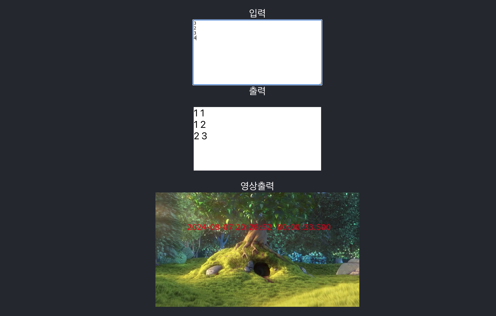

# Seadronix 사전관제
다음 순서로 프로그램을 시작한다.

## React HLS Server 시작 명령어

node hlsserver

## FFMPEG 스트리밍 시작 명령어

node stream

## React Web 프로그램 시작 명력어

npm start

## 브라우저에서 확인

브라우제에서 http://localhost:3000 입력후 결과를 확인한다

